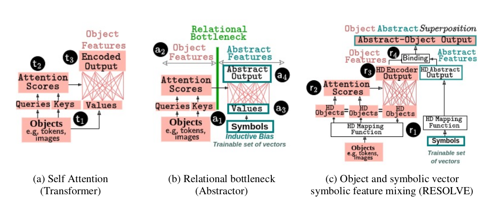

# RESOLVE

Welcome to the repository for the paper:

> **"RESOLVE: Relational Reasoning with Symbolic and Object-Level Features Using Vector Symbolic Processing"**



This repository contains modules and directories for evaluating the RESOLVE module across different relational tasks.

## Tasks

### Sequence-to-Sequence Tasks
These tasks take a sequence of tokens as input and generate a sequence of tokens as output.

1. **Purely Relational Tasks**:
   - Random Vector Sorting.

2. **Partially Relational Tasks**:
   - Mathematical Reasoning.

### Single Output Tasks
These tasks take a sequence of tokens as input and generate a single output.

1. **Purely Relational Tasks**:
   - Pairwise ordering.
   - Sequence pattern recognition (SET) using the final hidden layer of a CNN.

2. **Partially Relational Tasks**:
   - Sequence pattern recognition (SET) using low-processed object-level features (e.g., card images).
   - Mathematical abstract rule applied to pairs of MNIST digits.

## C++ Implementation

This repository includes a C++ implementation of Self Attention and HD Attention modules, with a focus on evaluating their computational overhead using the roofline model. The roofline model provides insights into the computational efficiency by considering:
- Bandwidth (L1 cache memory and DRAM)
- Processor speed

### Building and Running the Project
To build and run the performance analysis, use the provided Bash script. This script performs the following:

1. Builds the project using `cmake` and `make`.
2. Evaluates different embedding sizes and dimensions by running matrix multiplication and matrix HD Attention operations.
3. Collects and generates roofline reports using Intel Advisor.

### Example Usage of the Script

The script (`run_assessment.sh`) evaluates performance for different embedding sizes and dimensions using Intel Advisor.

#### Build and Run
```bash
#!/bin/bash

# Build the project
cmake ..
make
